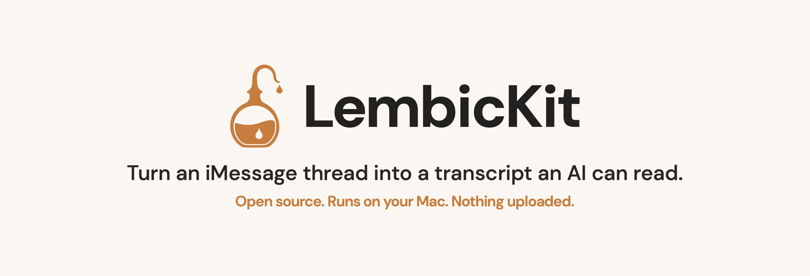

<p align="center">
  <picture>
    <source media="(prefers-color-scheme: dark)" srcset="Assets/hero-dark.png">
    
  </picture>
</p>

<p align="center">
  <a href="https://github.com/darecstowell/LembicKit/actions/workflows/ci.yml"></a>
  
  
  
</p>

# LembicKit

> An open-source alternative to iMazing and the other paid iMessage exporters, for one job: turning a conversation into text an AI can read.

LembicKit reads a macOS Messages database (`chat.db`) and turns a conversation into a transcript an LLM can use: a compact text file and a JSON-lines file. It runs entirely on your Mac. Nothing is uploaded.

It is the open-source engine behind Lembic, a Mac app built on top of it.

## The paid exporters write for paper, not for an AI

iMessage exporters like iMazing and Decipher TextMessage are built for backups and legal records. They write PDF, CSV, and Excel, formats made for printing and e-discovery. Paste a PDF of a long thread into ChatGPT or Claude and most of the context window goes to layout and bubbles, not the conversation. These apps are also closed source, and iMazing has been subscription-only since 2025, so you cannot read what they do with your messages.

LembicKit does one job instead. It reads the same local `chat.db` and writes a compact text file and a JSON-lines file, the formats an LLM reads cleanly. It is MIT licensed and free, with no network code, so you can read exactly what it does.

## It runs on your Mac, and you can read every line

Privacy is why this is built the way it is. LembicKit copies your `chat.db` to a temporary file, opens that copy read-only, and writes plain text. The library has no network code. You can audit the SQL it runs, how it decodes message bodies, and how it detects secrets, because all of it is here and covered by tests.

## What this is, and what it is not

This is a Swift library and a low-level command-line tool. It is not a finished app.

The CLI has no contact picker. You give it the raw row IDs of the chat and the handles you want, which you find by running the `conversations` subcommand first or by querying `chat.db` yourself. For most people that is the wrong tool: pulling your own messages out by hand is slow and easy to get wrong, which is the reason the Lembic app exists.

If you want a library to build on, or you want to read exactly what happens to your messages, you are in the right place.

## What the output looks like

You give it a chat and it writes two files. The `.txt` is grouped by calendar day and made to read well in a chat window:

```
# iMessage transcript with +15035550146
# 2026-05-27 → 2026-06-13 · 70 messages · 2 reactions · 5 with attachments
# Speakers: Me = the account owner, Them = +15035550146

## 2026-05-27 (Wed)
05:54 Them: Materials came in early, ahead of schedule
06:00 Them: [photo]
06:14 Them: Got it, thank you. Pleasure working with you
06:20 Them: No rush, end of week is fine
06:25 Me: love hearing that
```

The `.jsonl` is one message per line, for code that reads the thread programmatically:

```
{"d": "2026-05-27 05:54:35", "s": "Them", "m": "Materials came in early, ahead of schedule", "svc": "SMS"}
```

Attachments become short markers like `[photo]`, and dates and reactions are preserved, so a model gets the structure of the conversation without the byte cost of a PDF or the noise of raw CSV.

## Quick start

Build the package, then point the CLI at the example database included in this repository (no Full Disk Access needed, since the example is synthetic and lives here):

```sh
swift build

# list the conversations in a chat.db, newest first
swift run lembic-cli conversations Examples/chat.db

# export one conversation to a .txt and a .jsonl
swift run lembic-cli export Examples/chat.db --chat-id 6 --target-handles 6 --number +15035550146 --out-dir .
```

`conversations` prints the `chat-id` and `target-handles` that `export` needs. See [Examples/README.md](Examples/README.md) for more.

To run against your own messages, give it the path to your real database (`~/Library/Messages/chat.db`). Reading that needs Full Disk Access, which you grant in System Settings under Privacy and Security.

## Resolve names from Contacts

By default the transcript labels the other person by number. Pass `--contacts` to resolve names. The CLI can read names from a vCard file instead of the system Contacts store, which is useful for testing and for the example:

```sh
LEMBIC_CONTACTS=Examples/contacts.vcf swift run lembic-cli conversations Examples/chat.db --contacts
```

Without `LEMBIC_CONTACTS`, `--contacts` reads the system Contacts store, and macOS asks for permission the first time.

## Build and test

```sh
swift build
swift test
```

`swift test` includes a set of golden tests: the rendered output is compared byte for byte against committed reference files. That comparison is the audit. If a change alters the output, the golden tests fail until the reference files are regenerated on purpose. [CONTEXT.md](CONTEXT.md) explains how that works.

## How the code is organized

[CONTEXT.md](CONTEXT.md) is the map: the domain terms (Conversation, Transcript, Extractor, the secret detector and the scrubber), a file-by-file module table, and the invariants that hold the engine together. Read it before a non-trivial change.

## License and name

The code is MIT licensed (see [LICENSE](LICENSE)). The name "Lembic" and the logo are not; see [TRADEMARK](TRADEMARK) if you fork it. Third-party dependencies and their licenses are listed in [NOTICE](NOTICE).

## Lembic, the app

LembicKit is the engine. [Lembic](https://textstoai.com) is the Mac app built on it: a searchable contact picker, a live token-budget meter so a long thread fits in one chat, curated prompts, and on-device redaction that flags secrets before they leave your Mac. If reading SQLite by hand is not how you want to spend your evening, that is the one to use.
</content>
</invoke>
